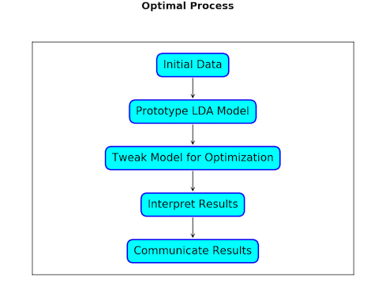
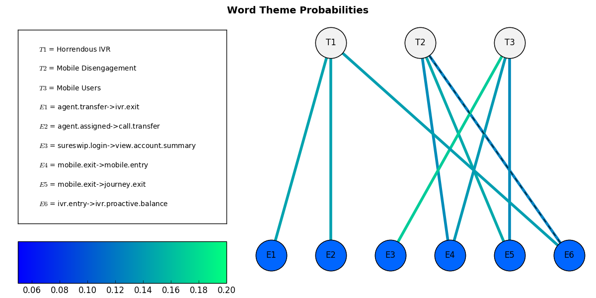
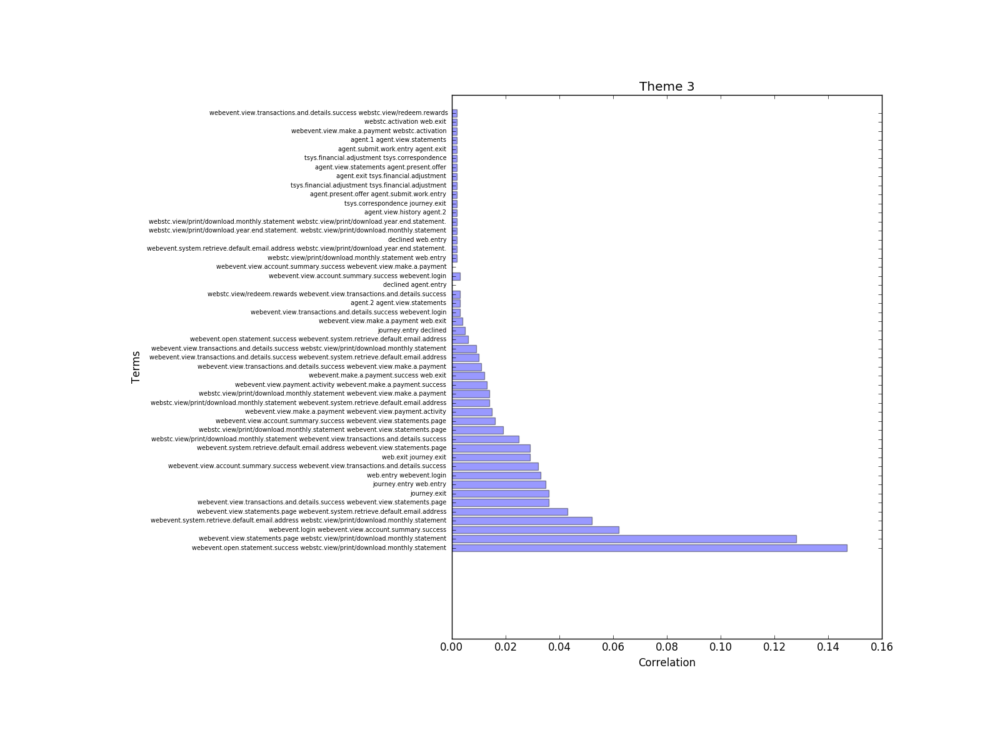

# Customer-Journey-LDA-Modeling

## Overview
<a href ='http://www.jmlr.org/papers/volume3/blei03a/blei03a.pdf'> Latent Dirichlet Allocation </a> (LDA) is a statistical model that extracts various topics from documents. It is usually used to cluster words by theme but I used it to cluster customer journeys for <a href='https://www.clickfox.com/'> Clickfox </a>. I found this problem incredibly interesting because it extends Natural Language Processing algorithms to non-natural language data. The goal of this project was to develop insights from modeling these customer journies with LDA.

## Navigating this Repo
For a good introductory overview, you can check out the <strong> word_transition_demo.ipynb</strong> file. Otherwise, the file structure of this repo can be seen below.  

 

The first model for this data clustered on individual events. This code can be found in the <strong>single_word_model</strong> folder. The results of running this model can be found at <strong>single_word_model/visualizations</strong>. This model is not particularly interesting.
 
The second model clustered on transitions between events (i.e. event_a and then event_b). The code for this model can be found in the <strong>word_transition_model</strong> folder. The model and resultant dataframe based on transitions can be found in the <strong>word_transition_model/data</strong> folder. The results (analysis/visualization/recommendations) based on this model can be found in the <strong>word_transition_model/theme_analysis</strong> folder.

## Process
 
This process involved numerous steps:
<ul>
    <li>Formatting the data properly
    <li>Building a prototype LDA model using Gensim
    <li>Developing preliminary visualizations for the model results
    <li>Tweaking the LDA model for optimization
    <li> Interpreting the model results
    <li> Gaining insights from these results
    <li>Creating visualizations to communicate these insights
</ul>

## The Data
The data used for this was 440,000 rows by 17,000 columns of customer journey events. Due to the size of this data, manipulation was done via numpy with multiprocessing. The data were pickled along the way to ensure that code was not run redundantly.

## The Results
The result of this model was a predictor that can categorize a customer journey as being a linear combination of the different model clusters. There are multiple ways to view the clusters. 

 For example, there is the graph view of the clusters. In this view, the top nodes represent different themes (T1-T3). Each theme is connected to different events (E1-E6). The probability of a word given a certain theme is represented by the color of the edge. The colors accord with the colormap.

Another visualization technique was the simple bar plot where each cluster was represented as a series of probabilities of different events (i.e. terms). In this visualization, each bar represents the probability of a word given a certain theme. 

 
Finally, you can approach the clusters from a single event's perspective. The below radar plot shows the event "journey.entry->web.entry" and its correlation with 4 different clusters.
 
web.entry.png', height='450', width='500'>
